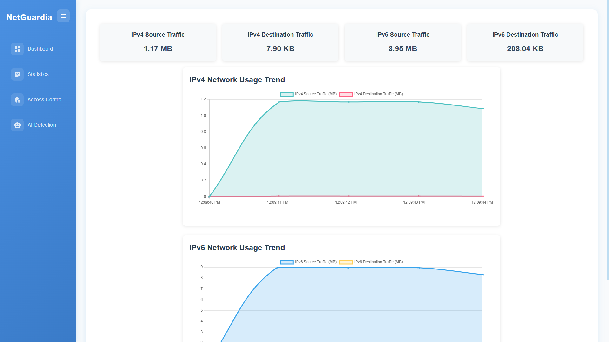
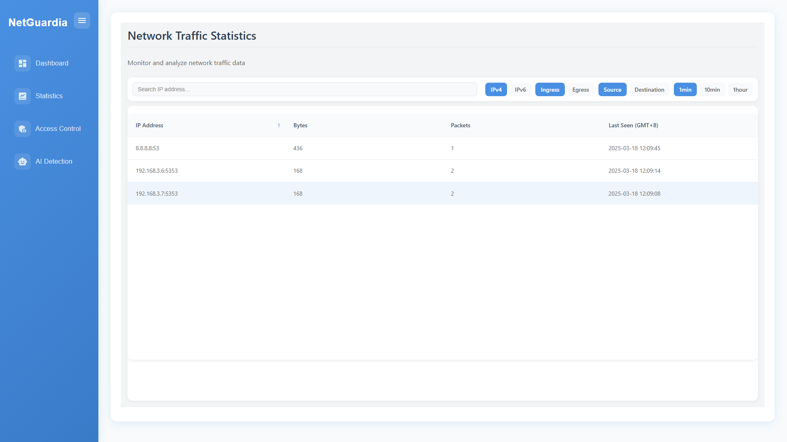
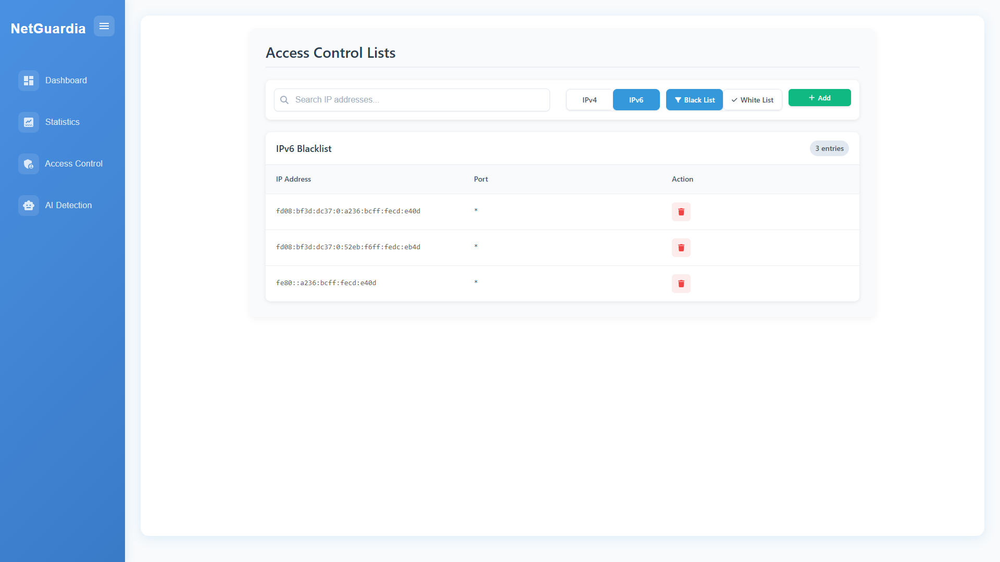
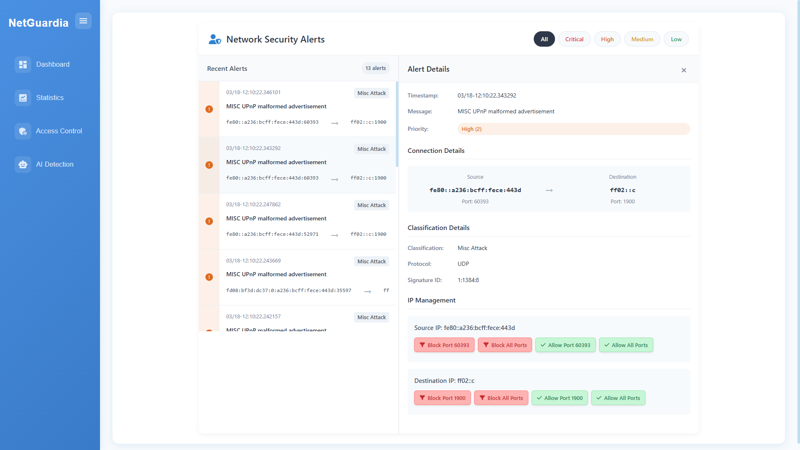

# NetGuardia 🛡️

## 📌 專案簡介

**NetGuardia** 是一個結合 eBPF XDP 與深度學習模型的實體網路防護裝置，運行於 Raspberry Pi 5 與 Intel i350 T2 網卡。本專案旨在提供高效能、低延遲的網路防護解決方案，適用於家庭與中小型企業環境。

## 🔧 核心技術

- **eBPF XDP 技術** - 實現高效能網路封包處理，直接在資料連結層操作
- **深度學習模型** - 識別與預測潛在網路攻擊，提供智慧化防護
- **嵌入式硬體整合** - 結合 Raspberry Pi 5 與 Intel i350 T2，提供獨立且強大的網路防護功能

## 🧩 功能模組

### 📊 儀表板總覽 (Dashboard)

- 即時網路流量監控與視覺化統計
- 近期流量大小統計與趨勢圖

### 📈 詳細流量統計 (Statistics)

- 各 IP 位址詳細流量使用情況

### 🔒 網路存取控制 (Access Control)

- IPv4/IPv6 黑白名單管理
- 精確的連接埠層級存取控制

### 🤖 AI 攻擊偵測 (AI Detection)

- 基於 AI 的攻擊偵測引擎

## ✨ 系統特色

- **⚡ 高效能** - 低延遲封包處理，最小化網路效能影響
- **👥 易用性** - 跨平台 Web 管理介面，直覺操作
- **🔄 可靠性** - 硬體加速處理，確保穩定運行
- **📦 可擴展** - 模組化設計，支援功能擴展

## 💻 安裝需求

- Raspberry Pi 5 (建議 8GB RAM 版本)
- 雙孔網卡(能支援 XDP native/offload 更好)
- 32GB 以上 microSD 卡 (建議 Class 10 以上)
- 5V/3A 以上電源供應器
